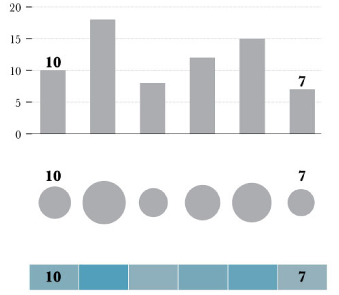

###  How to build a data analysis pipeline 

 
Athena Hadjixenofontos, PhD
 
Director of Engagement
 
Center for Computational Science
  
ahadjixenofontos@miami.edu
 

---

@title[Roadmap]
##  Roadmap 

- What is context?
- Design
- Implementation
- Inference and Visualization

---?image=images/bowl.jpg

@title[Context]

**context**  
 
*noun* | con·text
 
1: the parts of a discourse that surround a word or passage and can throw light on its meaning
 
2: the interrelated conditions in which something exists or occurs

Note:
We hear the word context a lot. The historical context of the times, quotes being taken out of context, but a deeper relationship with what that actually means is part of our objective today. 

---

Context has consequences 
 
for the interpretation of an observation. 

Note:
So context has consequences for the interpretation of an observation, which I think is the first layer of this deep onion we are peeling today.

Science is all about the interpretation of observations. 
We think of it as an objective truth, we see numbers and we assume that since something is quantified it must be unbiased. 
Even though we know that interpretations of observations are only meaningful within a specific context.  

---

@title[Pipeline overview]

Note:
As anyone who's ever done research, whether in an academic context or in the R&D department of a company can tell you, there's a lot that has to happen before you get to a place where you can make inference. 

A pipeline for your data analysis includes the following, very broadly defined stages:
In the design phase, you sharpen the question, make sure you have what you need to answer it
In the implementation phase, you dive in deep with the data, explore it, clean it, play with it and develop your intuition about it
In the inference stage, you build models, evaluate them, create visualizations and communicate the insights

The decisions you make along the way will be informed by the context of your data analysis. Two people can start at exactly the same place in terms of what data and methods are available to them and ask very similar questions, but the sight differences in their objectives will translate to different actions being appropriate at each stage. 

---

@title[Design]

## Design phase 
#####  Don't take shortcuts. 

+++?image=images/path-in-focus.jpeg

Note: 
The first thing you often do is read the literature. Where is the field? How have the questions you are interested in been asked before? 

The question that you seek to answer with your data analysis exists in the context of a long history of other people who have asked very similar questions. What approaches did they take? What's different about now? What obstacles did they encounter and how did they overcome them? 

This is a great way to bring the picture into focus, hone in on what you really actually are asking.

+++

> If I have seen further than others, it is by standing upon the shoulders of giants. 
>    Sir Isaac Newton 

+++

> If I asked my customers what they wanted, they would have said "a faster horse". 
>   Henry Ford 

Note: 
There is some art in how you form the question. You don't want it to be so general that it is meaningless, but you also don't want it to be so specific that it traps you inside a specific solution. 

In general, it is better to state the problem and keep that statement free of any methods or specific approaches. 

It is the difference between:
"How do my employees personalities influence their performance?"
and
"How can I use text data to predict my employees performance based on their personalities?"

+++

A  good question  is:
- informed by the literature
- answerable with the data available to you
- answerable with the methods available to you 
- falsifiable

Note: 
Reading the literature will take you from talking about employee personalities, in a very general and abstract sense, to thining about dimensions of personality that can be measured with the Five-Factor Personality Test and the other established and validated ways of measuring what you are interested in. 

If there is no established way to measure what you are interested in you are either still thinking about it too abstractly, or you have one more step that you have to complete before you can embark on your analysis. 

If you are using survey instruments check things like the face validity of your survey, which is usually judged by an expert, but also features such as the test-retest reliability and the internal consistency of the measures that are captured by the survey. 

+++?image=images/notepad.jpeg

Example: 	
 
- General domain: employee performance
- Available data: unstructured text data from CVs, emails, performance reviews
- Available methods, infrastructure: any, unlimited

Note: 
Let's spend a couple minutes thinking about this example. What else would you want to collect, if you had the freedom to? 

+++

Beware of your assumptions. 
 
They define the questions that you will think to ask. 

Note:
My favorite example here is the birth of the field of neurogenesis. 
For a long time, the dogma was that the last time that new neurons are born is during development.
A pair of researchers, Altman and Das, published evidence of adult neurogenesis in the best journals, in the 60's, but they were largely ignored by the scientific community. 

That wasn't enough to overturn the dogma that adult brains don't make new neurons. More researchers published evidence in the 70's, and drama ensued. Careers were destroyed by a combination of criticism and lack of support. The very things that we hold in highest regard, not extending inference of findings based on model organisms to humans, worked against us in this case. The first studies were done in birds, and a very influential researcher Pasko Rakic published a paper in Science, convincing researchers that adult neurogenesis was restricted to birds and rodents, and didn't happen in primates. It took another 20 years for the field to recover. Neurogenesis is now an entire field, and we know that it may have a role in learning and memory. 

Hindsight is 20-20. It's not that it's hard to keep an open mind, it's the idea of how far do you take a notion for it to require "an open mind?". What does the data say? Has there been data collected on adult neurogenesis in primates? That was a question that we maybe wouldn't even think to ask if not prompted by the studies in birds and rodents. 

+++?image=images/gage-neurogenesis.png

Note:
In this paper from 1995, a group of researchers looked at the dentate gyrus, which is a region of the hippocampus that undergoes neurogenesis. 
They show that cells isolated from that region can be cultured in vitro, and they can survive, proliferate and express neuronal and glial markers. They also labelled the cultured cells so that they could track them, and transplanted them back in the brain of a rat. Two months later they found labelled cells that had matured and differentiated into neurons. 

+++?image=images/camera.jpeg

Give yourself a point of reference. 

Note:
Going back to our previous example with employee engagement based on employee personality, let's say that you came up with an awesome way to describe employee personality based on the text data that is available. 
How do you know that the personality that you detected is indeed the true personality of that person? 
(wait for their answer)

Experimental scientists call these controls. How do you know that a high performer is a high perfomer? 
Even more crucial if you have an intervention as part of your data. How do you know that the system you set up will produce a negative result when you expect a negative result and a positive one when you expect a positive result? If you see a negative result is it because the intervention, even when present, doesn't work or is it because the intervention wasn't actually present to begin with?

+++ 

Setting a baseline is easier in some cases than in others. 
 
 
It is essential in giving yourself a clear context for the interpretation of your results. 

Note: 
You really need to think through, before you embark on your analysis, "if I see this, what will it mean?" 
Do you need additional information to be able to interpret your observation? 
Can you bring that information into your analysis? 

This is also the purpose of a pilot study, where you can figure all of this out before spending lots of times and money on a big scale study that turns out to be inconclusive. 

Be deliberate and thorough. 

+++

####  Seeing Black:  Race, Crime, and Visual Processing

 
 
**Population:** 41 white, male, UC Berkeley and Stanford university students
 
 
**Approach:** subliminal exposure of participants to face stimuli for 30ms, then exposure to object stimuli

Note:
Psychology and the social sciences in general, are notorious for bad study design and as the fields that struggle with replication the most. They were the last to catch on and start using the scientific method, and with good reason! The number of variables that become relevant when we are talking about human behavior is intractable and the systems are complex. This is in contrast to systems that are deterministic, controlled by a small number of variables and can be modeled explicitly. Physicists and engineers actually have it easy, because they are the most likely to work with these systems in which you can model every component explicitly. 

The conversation about how to think of complex systems can fill years and years of courses and study, so they key thing to take away from our conversation today is that designing a project that involves complex system will be different than working in a deterministic context, and you need to account for that in your design. 

Automatic stereotyping is the idea that the mere presence of a person can lead one to think about the concepts with which that person's social group has become associated. 

In this study, a group of four researchers designed an experiment where they sought to establish that exposure to black faces can decrease the perceptual thresholf for recognizing crime-related objects, to test the possibility that the stereotypic association between blacks and crime influences visual processing. 

face stimuli: color photographs of 50 Black or 50 White young adult male faces, or no face/random lines stimulus for 30 ms
object stimuli: 2 types object images (gun or knife) and (book or camera) 

+++

+++

 
What else could have generated these results?

Note:
After subliminal exposure to Black face primes, fewer frames were required to detect crime-relevant objects in comparison with crime-irrelevant objects t(13) = 2.96, p = 0.01

Were all the images equal in 

Did the photographs have more angry faces in one group than in the other? 
Other differences? Better dressed? Different backgrounds?

Was it a difference in attentional bias rather than a true difference in visual processing? 
What influences attentional bias? How do you measure it?

+++

####  Statistical power 

... or the probability that you will be able to distinguish between a true effect of a certain size and chance. 
 
 
**Exercise:** 
 
Plot power curves for a two-tailed t-test, using pwr in R

Note:
Switch to RStudio

+++

####  Quality Control 

Identify QC metrics that you will use, ahead of time if possible. 
 
 
Think back to our employee performance example. 
 
Do we expect any features of data collection to impact the quality of data that we get? 

Note:
Rate of missingness is a big one, does it matter for your analysis whether or not you have lots of missing data? Does it indicate that something went wrong with the rest of the data that belongs to that same observation or are all values for that observation independent? 

+++

####  Database format 
Think about:
- Appropriate data types
- Being able to easily query it!
- Minimizing wrangling

Note:
If you have any say in how the database that receives the data is designed, then use that to help you avoid as much tricky data wrangling as possible. 
A data scientist should not also be a data engineer, in my opinion, it's just too much work for one person, but they should work closely together. 

Export a small sample of what it looks like, take it through a draft of your pipeline and see what you can improve. 

If you don't think about this last point ahead of time, you will be adding steps to your pipeline where you are formating your data in preparation for being able to dive into it. 

+++

### Think it through. 

---

@title[Implementation]

## Implementation phase 
#####  Go to town! 

+++

 

+++

 

+++

 

+++

 

+++

The goal of quality control is to  gain trust in your data . 

+++
Follow the bread crumbs.  

 
Some of the clues that your data are unreliable may be difficult to uncover.

Note: 
Data is messy. That's okay. It's not a reflection on you (well it may be, if you didn't take the design phase seriously) and in any case, you want to be the one to find out 

+++

###  Descriptive statistics 
* Check the distributions of all key variables. 
	* Basic statistics, outliers, missing values
* Drop observations if appropriate. 
* Preliminary visualization of relationships between variables.
	* Scatterplots, boxplots, barplots

+++

###  Dimensionality reduction 

- Decision trees
- Correlation between all variables
- Backward or forward feature selection
- Factor analysis
- Collapse on major axes of variation

Note:
Random Forests are a special case of that first bullet. They are biased towards continuous variables, so you need to keep that in mind if you have binary or categorical variables that you expect will be important to keep. 

The method you choose depends on the data that you have, and what you set as your priorities.
Resulting dimensions are less interpretable. 

+++

 
Sawcer et al. 2011, Nature Genetics 

+++

 
By Reddit user everest4ever 

Note:
He says:
People in my office got into a huge debate about what are eligible entries for the cookie competition (e.g. are mini-pizzas cookies), and I was inspired by the Sandwich Alignment Chart to analyze the ingredient list of baked good recipes.

I scraped 1931 recipes from the Food Network that contain the keywords cookies (my group of interest), pastry, or pizza (two control groups). Next I extracted the ingredient list and pooled similar ingredients together (e.g. salt, seasalt, Kosher salt), coming up with a total of 133 unique ingredients. I ended up with a 1931x133 matrix, where each row is one recipe, and each column is whether this recipe contains a certain ingredient (0 or 1).

I then tried to reduce the dimensionality of the data using principal component analysis (PC1 & PC2 are the first two principal components), and found that there is a nice separation between cookies and pizzas along the first principal component, but there is substantial overlap between cookies and pastries.

The major contribution to PC1 are: sugar, butter, vanilla, eggs, and baking soda (in the positive/cookie-like direction); cooking oil, cheese, garlic, dough, tomatoes, onions, and black pepper (in the negative/pizza-like direction), which makes intuitive sense.

+++

###  Take away: 
Your choice of how to deal with multiple dimensions will impact how the information is undestood and interpreted. 

The effect is even more pronounced in high-dimensional data, where your choices will include which dimensions to  highlight  and which to  ignore . 

+++

 
xkcd.com/1524

+++

####  Build a modular pipeline 
 
Your choices of where to break up the various operations will impact the ease with which you or other researchers can repurpose your tools for other analyses.

---

@title[Inference]

### Inference phase
####  Choose your words carefully. 

+++

####  Samples and populations 

A parameter characterizes a population. 
  
A statistic characterizes a sample.
  
**Exercise:** 
Take samples of varying size from a standard normal distribution to demonstrate the difference between a parameter and a point estimate. 

Note: 
In order to truly understand why inference can be such a tricky thing to make, we need some basic statistical concepts, that you're probably already familiar with. First on the list is how to think about samples and populations. 

Change to RStudio. 

+++

####  Statistical bias
*Systematic* differences between the population parameter and the sample estimate, introduced by the way a statistic is calculated. 

Note:
A statistic is a mathematical expression that expresses a measure of an attribute of a sample, such as the mean. These functions are not always good estimators of the underlying population parameter, and they can introduce bias in your estimate. 

+++

Types of bias:
* ascertainment bias
* detection bias
* funding bias
* reporting bias
* recall bias

Note:

The errors are actually usually not due to the function itself, but due to the data that you feed it. 
For example, acertainment bias is when your sample is not representative of the population that they are drawn from. When we were carrying out ascertainment for a study in multiple sclerosis, we did that through an MS clinic, so our sample was biased for people who would go to an MS clinic as opposed to a neurologist in a different department. 

+++

####  Misplaced causality 

**Example:**
Do managerial styles of tech giants predict company success? 
  
What assumptions do we make by asking this question? 

Note:
Won't be so obvious when you are dealing with things that are not intuitive. 

+++

####  Misplaced causality 

**Example:**
Some personality traits predict do behaviors, but it's a leap to assume that this is the case without explicit evidence.

+++

 
 xkcd.com/552 

Note:
Even when there is a measured correlation, it says nothing about causation. 
The criteria for causation are very strict. 
Epidemiologists use the Hill criteria, which include things like the strength of association between the two variables, consistent association, specificity, temporality, dose response, plausibility of the mechanism, coherence with the evidence known so far, or analogy to an established risk factor

+++
####  Take away: 
Resist the urge to fill in the blanks. 

Note:
In our employee personality and performance example, it would be a jump to go from talking about the traits that you have measured, infer behavior and then somehow try to link those behaviors to their performance! 

If you found that employees with high individualism, which is the tendency to focus on oneself and one's personal goals, perform better at public presentations, it would be a leap to assume that it's because they prefer to engage in behaviors that make them stand out from others, even though that behavior is correlated with individualism in the literature. 

Fortunately, leaps are also known as hypotheses, so you could devise a follow up study to see if that is indeed true. 

Academics tend to care more about mechanism than business people. It's the difference between wanting to know WHY individualists perform better at public speaking, and only wanting to know THAT individualists perform better at public speaking - which is actionable information. 

+++

 
Note:
Okay, so now that we know what's what and what to look out for, let's actually do some modeling. 
+++

####  Inferential statistics 
Which modeling approach is appropriate depends on:
* types of variables
* relationships between observations
* distributions of variables
* sample size
* correlations between variables

Note:
Because the model is mathematically expressed, we are forced to make some assumptions. You all know that you need to use different models for example when your outcome is a continuous variable vs when it is a binary variable. If the observations are not independent, you need to use a repeated measures design. This is often useful with longitudinal data where you have multiple measurements on the same individual. 

+++

####  Statistical significance 
A *p-value* is the probability of observing such an extreme value of the test statistic by chance. 

It doesn't have to do with how important the finding is. 

Note:
From any of these tests, you'll get the celebrated p-values. When we talk about inference, we always bump into a discussion of statistical significance. 

We have some intuition as to what that means now that we've done the power exercise. 

+++

> All models are wrong but some are useful. 
>   George Box

+++

> Any conclusion is only as sound as the model on which it is based.
>   Prof. Diego Kuonen 

+++

####   Machine learning 
* Supervised learning algorithms 
* Semisupervised learning
* Unsupervised learning
* Reinforcement learning

Note:
Machine learning is also a type of modeling, which has been around since the 1950s. Frank Rosenblatt's perceptron, which is an algorithm for learning a binary classifier, was conceived in 1957. 

How do you choose which suits your data?

Supervised learning models are trained with inputs for which the outputs are known. They include regression, classification, prediction and gradient boosting. 

Unstructured learning is where the system is not told the "right answer." The algorithm must figure out what is being shown. The goal is to explore the data and find some structure within. You may have heard of self-organizing maps, nearest-neighbor mapping, k-means clustering, and singular value decomposition. 

Semisupervised learning is where you have a mix of labeled and unlabeled data in your training set. Can also be used with methods like classification, regression and prediction. 

Reinforcement learning is where the algorithm discovers which actions yield the greatest rewards through trial and error. 

All machine learning algorithms have the objective of minimizing the error, optimizing a loss function, which if you are familiar with regression you might draw some parallels to minimizing the sums of squares of the residuals. 

+++

####   Machine learning:  pros and cons

Explosion in ML is connected to both availability of data, and improvements in technology. 
  
The computer probes the data for structure, in the absence of a theory of what that structure looks like. The extracted features are difficult to interpret.  

Note:
In the context of the times, the explosion in the popularity of ML is linked to both the data and the technology. 

It's great, and it's not going to solve all our problems. One issue that you need to consider before choosing a ML algorithm for your problem is how difficult it is to interpret the features that are extracted. 
It's the price to pay for having no explicit rules that are programmed by the human into how to make the decisions. On one hand you can model observations in much more detail, on the other hand it's really difficult to explain why, other than simply observing that it works. 

Another advantage of ML is that the data doesn't need to meet strong distributional assumptions, like with a statistical model where the math is worked out but only under those specific circumstances. 

+++

####   Translation
Machine learning | Statistics
---|---
label | dependent variable
feature | variable 
feature creation |  transformation
weights | parameters
network, graphs | model
learning | fitting

 Some of the translations credited to Robert Tibshirani, Stanford. 

Note:
Although I believe that arguing over whether classical statistics, including regression, is actually machine learning is a waste of time, I have found it useful to draw these parallels in the vocabulary used by these communities. 

---

@title[Visualization]

####   Visualization 

How do you communicate uncertainty? 
  
How do you communicate all the decisions that you made along the way, that form the context for interpreting your results?

Note:
You do need to communicate responsibly. Understaning how the human mind processes the visual information is really important in creating effective, responsible visualizations. 

+++

####   Elementary perceptual tasks 

Cleveland & McGill, 1984

Note:
The first to really try to systematically understand how we understand visual information were William Cleveland and Robert McGill in 1984. The diagram here shows a ranking of what they called elementary perceptual tasks, in order of how accurate the judgements are that flow out of them. So for example if you show a human the information as a point along a scale, they will much more accurately understand that information than they would if you showed it to them as a map with different shades of red.

What about the angles, what common graphic uses those? 

It’s not that the less accurate ways in which we perceive information are bad, it’s again that you have to be aware of what message you want to send and how the way that you choose to visualize it may affect it. It may be totally okay to be inaccurate for some messages, but simply unacceptable for other messages. It depends on what you want to say. 

+++

+++

Be deliberate about the perceptual tasks 
that you assign to your audience. 

---

####   Take away: 

**Your design, analysis, implementation and visualization decisions provide the context for the interpretation of your results.**

---

@title[Biases and assumptions]

> We don't see things as they are, we see them as we are. 
>   Anais Nin 

+++

What are the barriers to operating with a conscious awareness of your biases?

+++

Confidence and curiosity can co-exist. 

Note:
Culture of knowing. 
Business vs science circles.

---

@title[Bottom line]

You may not know 
 
what you don’t know,
 
but, what you can know
 
is that you don’t know.

Note:
Be aware, if not of your biases, at least of the fact that you have biases.

What are you blind to? Easy to ask but difficult to answer because hindsight is 20/20.

The point isn’t to catch yourself, to be adabtable, curious, inquisitive, persistent, and to always want to learn. 

---

Thank you

